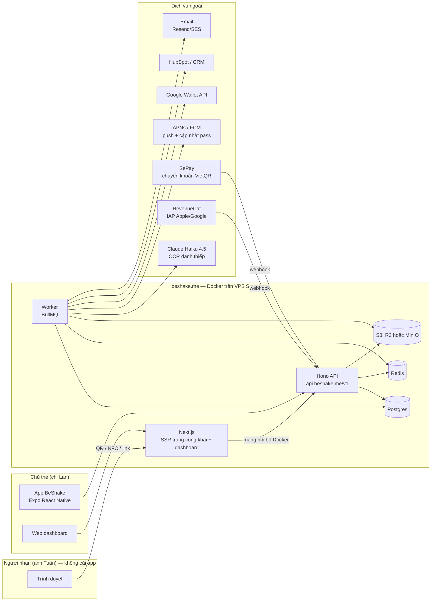
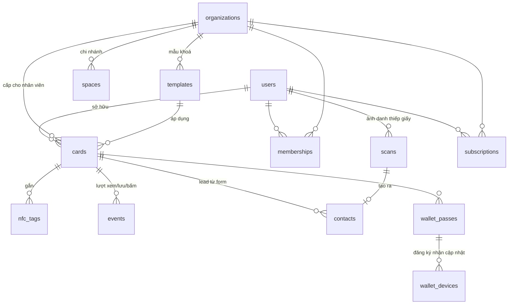

# BeShake — Thiết kế hệ thống

Ngày: 22/09/2026 · Trạng thái: bản nháp đầu, chờ Leo duyệt · Phạm vi: app iOS/Android + web beshake.me, thị trường Việt Nam.
Nguồn tính năng: [findings packet](../reports/findings-packet-260922-0120-beshake-digital-namecard-features.md) (67 tính năng, 57 claim có nguồn). Số `#NN` dưới đây trỏ về danh mục tính năng trong packet.
Theo yêu cầu: **không bàn pháp lý** trong tài liệu này. Chỗ nào một lựa chọn kỹ thuật rẻ giữ được đường lùi thì ghi một dòng, không phân tích.

## 0. Từ điển (định nghĩa một lần)

| Từ | Nghĩa |
|---|---|
| **Monorepo** | Một kho mã chứa nhiều app (web, mobile, worker) dùng chung thư viện. |
| **SSR** | Máy chủ dựng sẵn HTML rồi gửi xuống; trang hiện ngay, không chờ JS. Cần cho trang danh thiếp mở từ QR. |
| **ORM / migration** | Thư viện ánh xạ bảng SQL sang kiểu TypeScript; migration = file ghi từng thay đổi cấu trúc bảng. |
| **Queue / worker** | Hàng đợi việc nền (OCR, gửi push, đồng bộ CRM) và tiến trình riêng xử lý chúng, để API trả lời nhanh. |
| **Presigned URL** | Link tải lên có chữ ký, hết hạn sau vài phút; app đẩy ảnh thẳng lên kho file, không qua API. |
| **Webhook** | Bên khác gọi ngược vào API của mình khi có sự kiện (ví dụ SePay báo "đã nhận tiền"). |
| **Universal link / App Link** | Link web thường; máy đã cài app thì mở app, chưa cài thì mở web. |
| **Entitlement** | Quyền theo gói (Free/Pro/Business) — một nơi duy nhất quyết định "gói này được làm gì". |
| **Idempotent** | Gọi lại nhiều lần vẫn cho cùng kết quả; bắt buộc với webhook thanh toán. |
| **JWT** | Chuỗi ký số chứa thông tin; Google Wallet nhận thẻ qua JWT. |
| **NDEF / NTAG** | Định dạng dữ liệu ghi trên thẻ NFC / dòng chip thẻ (213 = 144 byte, 215 = 504, 216 = 888). |
| **vCard** | Định dạng chuẩn "một mục danh bạ" (.vcf). |
| **CRC** | Mã kiểm lỗi cuối chuỗi VietQR. |

## 1. Hợp đồng brainstorm

- **Outcome:** một hệ thống ba mặt — (1) app BeShake cho chủ thẻ tạo, chia sẻ, nhận liên hệ; (2) web beshake.me hiện danh thiếp cho người nhận **không cần cài app**, kèm bảng điều khiển; (3) gói doanh nghiệp quản trị đội — triển khai theo 6 phase, phase 2 là bản dùng được đầu tiên.
- **Constraints:** một nhóm nhỏ, một ngôn ngữ (TypeScript) cho web, mobile, backend; trang công khai phải nhẹ và chạy trên Android cũ; thẻ NFC chứa link web thật (`https://beshake.me/...`) vì iPhone không đọc scheme riêng (packet C33); Android không còn "app chạy tức thì" (C40); gói cá nhân mua trong app phải qua Apple/Google (C49); máy chủ tại Singapore (Q7); **URL thẻ không đoán được** (≥ 64 bit ngẫu nhiên, Q11) — là hợp đồng công khai in lên thẻ và ghi vào chip, chốt trước phase 2.
- **Non-goals:** phân tích pháp lý, hồ sơ tuân thủ; App Clip; Apple Watch; điện thoại giả làm thẻ NFC (iOS không cho, C35); kênh cộng tác viên (quyết định kinh doanh, không phải tính năng); native Swift/Kotlin riêng.
- **Acceptance:** xem `plan.md` mục "Success Criteria" — mỗi tiêu chí là một tình huống đo được trên thiết bị thật.

## 2. Quyết định giả định (Leo đổi được, plan ghi rõ chỗ nào đổi theo)

| # | Quyết định đã giả định | Nếu đổi thì… |
|---|---|---|
| Q1 | **Đã chốt (Leo, 22/09):** doanh nghiệp trả tiền; cá nhân dùng miễn phí làm phễu | Thứ tự thực hiện: phase 5 trước phase 4 |
| Q2 | Thẻ NFC do xưởng in đối tác sản xuất, **ghi sẵn mã thẻ và khoá** tại xưởng; app chỉ cần *đọc để nhận thẻ* | Nếu tự bán thẻ: thêm kho, đơn hàng, vận chuyển ở phase 5 |
| Q3 | ~~Máy chủ đặt Singapore hoặc Việt Nam; vùng là biến cấu hình~~ — thay bằng Q7 (Singapore) | Không đổi mã, chỉ đổi nơi deploy |
| Q4 | Form trao đổi ngược có trong MVP, kèm ô đồng ý (1 checkbox, 1 cột DB) | Bỏ form → bỏ bảng `contacts` khỏi phase 2, chuyển sang phase 4 |
| Q5 | Nút chuyển khoản VietQR có trong MVP | Bỏ → bỏ trường `bank` khỏi card, chuyển sang phase 4 |
| Q6 | **Đã chốt (Leo, 22/09): web là chính.** Trình sửa thẻ đầy đủ trên web ngay MVP; app vẫn có trình sửa (cần cho NFC, widget, quét danh thiếp) nhưng làm sau web | Nếu quay lại app-first: đảo bước 1 và 9 của phase 2 |
| Q7 | **Đã chốt (validate 22/09):** VPS tại Singapore, Docker Compose | Đổi vùng = đổi nhà cung cấp VPS, không đổi mã |
| Q8 | **Đã chốt (validate 22/09):** API tách riêng bằng Hono (`apps/api`, `api.beshake.me`); Next.js chỉ dựng trang; chỉ API và worker chạm Postgres/Redis | Nếu gộp lại vào Next.js: chuyển route sang route handlers, giữ nguyên `packages/core` |
| Q9 | **Đã chốt (validate 22/09):** cuối phase 2 ra mắt web trước (mốc 2a), app theo sau trong cùng phase (mốc 2b) | — |
| Q10 | **Đã chốt (validate 22/09):** xưởng in tự ghi và khoá chip bằng máy của họ theo file CSV BeShake cấp; app giữ chế độ cấp phát cho lô nhỏ | Nếu tự ghi: bật lại chế độ cấp phát trong app làm đường chính |
| Q11 | **Đã chốt (brainstorm 22/09):** URL thẻ là mã ngẫu nhiên `beshake.me/c/<public_id>` — 12 ký tự base58 từ CSPRNG (58¹² ≈ 2⁷⁰). Mã thẻ NFC nâng lên 13 ký tự base32 (2⁶⁵). Tên đẹp `beshake.me/<tên>` chỉ là tính năng Pro (phase 4), tự bật, mặc định tắt, có cảnh báo | Nếu cho tên đẹp ở Free: bỏ tiêu chí "chống cào" trong plan.md |
| Q12 | **Đã chốt (brainstorm 22/09):** "Đổi link" sinh `public_id` mới, link cũ trả 404 ngay (đồng nhất với 404 thường); thẻ NFC vẫn mở vì chip trỏ qua mã thẻ; QR in giấy phải in lại — app cảnh báo trước | Nếu muốn chuyển hướng tạm: thêm cột `previous_public_id` + hạn |

## 3. Ba hướng kiến trúc đã so sánh

| Hướng | Mô tả | Giả định nặng nhất | Gãy đầu tiên khi | Trường hợp xấu nhất | Chi phí bỏ dở |
|---|---|---|---|---|---|
| **A. Một monorepo TypeScript** (Next.js + Hono API + Expo + Postgres + worker) — **chọn** | Web, API, mobile cùng ngôn ngữ; backend tự viết nhưng mỏng | Nhóm thoải mái với TypeScript ở cả 3 nơi | Cần tính năng native sâu (NFC khoá thẻ, widget) mà module Expo chưa phủ | Phải viết vài module native nhỏ; mọi thứ khác vẫn chạy | Thấp: domain logic nằm ở `packages/core`, tách API ra dịch vụ riêng sau vẫn được |
| B. Dùng Supabase làm backend | Postgres + Auth + Storage + Edge Functions có sẵn; gần như không viết backend | Mô hình tổ chức/quyền/gói doanh nghiệp diễn tả được bằng RLS + Edge Functions | Phase 5: Spaces, mẫu khoá, offboarding, đồng bộ CRM thành mớ policy khó đọc | Viết lại backend giữa chừng khi khách doanh nghiệp đầu tiên đến | Trung bình: schema giữ được, logic phải chuyển |
| C. Cloudflare-native (Workers + D1 + R2) | Trang công khai chạy ở biên, rất nhanh toàn cầu | Ký `.pkpass` (PKCS#7) và các thư viện Node chạy được trên Workers; D1 (SQLite) đủ cho dữ liệu doanh nghiệp | Ngay phase 3: ký pass Apple trên runtime Workers | Phải thêm một dịch vụ Node riêng chỉ để ký pass — quay về gần hướng A | Trung bình |

**Kết luận:** A là hướng nhỏ nhất vẫn đáp ứng hợp đồng, và rẻ nhất để bỏ dở. B nhanh hơn 2–3 tuần ở MVP nhưng trả giá ở phase 5. C tối ưu thứ không cần (tốc độ toàn cầu) và gãy ở thứ cần (ký pass).

## 4. Kiến trúc tổng thể



| Thành phần | Chọn gì | Vì sao (một dòng) |
|---|---|---|
| Web | Next.js (App Router): trang công khai SSR, dashboard, trang tiếp thị; gọi API qua mạng nội bộ Docker, **không chạm DB** | Chỉ lo dựng trang; đổi giao diện không đụng dữ liệu |
| API | Hono (Node) tại `apps/api`, `api.beshake.me/v1`, zod kiểm tra đầu vào, OpenAPI sinh từ zod | Ranh giới rõ: web, mobile, webhook ngoài đều đi qua một cửa; chỉ API và worker chạm Postgres/Redis (Q8) |
| Mobile | Expo (React Native) + **dev build** (không dùng Expo Go) | NFC và widget cần module native; dev build cho phép cài chúng |
| DB | PostgreSQL 16 + Drizzle ORM | Kiểu TypeScript sinh từ schema; migration là file, review được |
| Auth | Better Auth chạy trong `apps/api`: email + OTP, Google, Apple, Microsoft; plugin organization; `@better-auth/sso` ở phase 6; web và mobile chỉ dùng client (`@better-auth/expo`) | Có sẵn tổ chức/vai trò/lời mời. Kiểm npm 22/09: better-auth 1.7.5, @better-auth/expo 1.7.5, @better-auth/sso 1.7.5 |
| Việc nền | Redis + BullMQ, app `apps/worker` | OCR, push, webhook, đồng bộ CRM không được chặn API |
| File | S3-compatible (Cloudflare R2 lúc đầu; MinIO nếu muốn tự host), upload bằng presigned URL | Ảnh/PDF/scan không đi qua API |
| OCR | Claude Haiku 4.5 (đọc ảnh, trả JSON theo schema) | Một lệnh gọi ra đúng cấu trúc, không cần bước hậu xử lý riêng |
| Wallet | `passkit-generator` (Apple) · Google Wallet REST + JWT "Save to Wallet" | Thư viện Node ổn định; Google chỉ cần tài khoản issuer |
| Thanh toán | RevenueCat (IAP cả 2 nền tảng) · SePay (chuyển khoản VietQR, webhook) | RevenueCat gom StoreKit/Play Billing về một webhook; SePay có skill sẵn |
| Push | Expo Push (APNs/FCM) cho app · APNs trực tiếp cho cập nhật pass Apple | Hai kênh khác chứng chỉ |
| Email | Resend hoặc SES | Giao dịch: OTP, hoá đơn, mời thành viên |
| Giám sát | Sentry (web + mobile + worker), uptime ping `/healthz` | Biết lỗi trước khi khách báo |

## 5. Cấu trúc monorepo (Turborepo + pnpm)

```
beshake/
  apps/
    web/        Next.js: trang công khai /c/<id>, /t/<code>, /c/<id>.vcf, dashboard, admin — gọi api, không chạm DB
    api/        Hono: /v1/* cho web + mobile + public API; webhook SePay/RevenueCat; Apple Wallet web service
    mobile/     Expo: editor thẻ, chia sẻ, nhận thẻ NFC, quét danh thiếp, widget
    worker/     BullMQ: ocr, wallet-refresh, webhook-deliver, crm-sync, rollup, email
  packages/
    core/       vcard.ts, vietqr.ts, entitlements.ts, slug.ts, schemas (zod) — thuần TS, test kỹ
    db/         schema Drizzle, migrations, seed
    api-client/ hàm gọi api.beshake.me/v1 có kiểu, dùng chung web + mobile
    ui/         component web (shadcn/ui + Tailwind)
    config/     eslint, tsconfig, prettier dùng chung
  infra/
    docker-compose.yml, Caddyfile, backup.sh
```

Nguyên tắc: **logic đặt ở `packages/core`, không đặt trong màn hình.** Ví dụ sinh vCard, sinh VietQR, kiểm quyền gói — cùng một hàm chạy ở web, mobile và worker (DRY).

## 6. Mô hình dữ liệu



Bảng chính và các cột đáng chú ý (đủ để viết migration ở phase 1):

| Bảng | Cột đáng chú ý | Ghi chú |
|---|---|---|
| `users` | id, email, name, avatar_key, locale, plan (`free/pro`), deleted_at | Xoá tài khoản = xoá thật sau 7 ngày (job) |
| `organizations` | id, name, slug, logo_key, plan (`business`), seats, settings jsonb, custom_domain | |
| `memberships` | org_id, user_id, role (`owner/admin/member`), space_id, status (`active/suspended`) | Khoá nhân viên = `suspended` |
| `spaces` | org_id, name | Chi nhánh/phòng ban (#47) |
| `templates` | org_id, theme jsonb, locked_fields text[], default_links jsonb | Nhân viên không sửa được cột trong `locked_fields` (#38) |
| `cards` | user_id, org_id?, template_id?, **public_id** unique (12 ký tự base58, sinh từ CSPRNG — Q11), vanity_slug? unique (Pro, mặc định null), link_rotated_at, status (`active/paused/inactive`), name_parts jsonb `{family, middle, given}`, display_name, title, company, department, tagline, avatar_key, cover_key, logo_key, theme jsonb, fields jsonb[], links jsonb[], bank jsonb `{bin, account, holder}`, pin_hash?, lang (`vi/en/both`), i18n jsonb, seo_indexable (mặc định false), version | `fields`/`links` là mảng có `order` và `visible` (#9). **`public_id` là định danh duy nhất lộ ra ngoài** — không bao giờ lộ `id` nội bộ hay số tự tăng ở URL, vCard, pass, API |
| `nfc_tags` | **code** unique (13 ký tự base32 Crockford từ CSPRNG, 2⁶⁵ — Q11), batch_id, uid?, card_id?, org_id?, status (`provisioned/claimed/retired`), chip, written_at, claimed_at | Mã thẻ ổn định, trỏ lại thẻ khác được (mục 7) |
| `tag_batches` | id, count, password_enc, factory, status (`exported/received/accepted/rejected`), sample_verified | Một lô gửi xưởng; mật khẩu khoá chip theo lô, mã hoá tại chỗ (Q10) |
| `contacts` | owner_user_id, org_id?, card_id, name, phone, email, company, title, note, tags text[], source (`form/ocr/manual`), consent jsonb, follow_up_at, scan_id? | Lead + danh bạ đã quét (#28, #29, #31) |
| `scans` | user_id, image_key, status, result jsonb, model, cost_cents | Một hàng một lần OCR; đếm hạn mức theo tháng |
| `events` | card_id, org_id?, type (`view/save/click/lead/wallet_add`), source (`link/qr/nfc/wallet/offline`), target?, visitor_hash, ua_family, created_at | Chỉ ghi thêm, không sửa; index `(card_id, created_at)`; partition theo tháng khi > 10 triệu dòng |
| `wallet_passes` | card_id, platform (`apple/google`), serial, auth_token, object_id?, updated_at | |
| `wallet_devices` | device_library_id, pass_id, push_token | Chuẩn web service của Apple |
| `subscriptions` | user_id? / org_id?, plan, provider (`revenuecat/sepay/manual`), external_id, status, period_end, seats | |
| `orders` | org_id/user_id, items jsonb, amount, status (`pending/paid/shipped`), payment_ref, address jsonb | Thẻ vật lý (Q2) |
| `integrations` | org_id, provider (`hubspot/salesforce/zapier`), credentials_enc, settings, status | Token mã hoá bằng khoá server |
| `webhooks`, `webhook_deliveries` | url, secret, events[], attempts, last_status | Ký HMAC, thử lại 5 lần |
| `api_keys` | org_id, key_hash, scopes[], last_used_at | Chỉ lưu hash |
| `audit_logs` | org_id, actor_id, action, target, created_at | Bảng quản trị doanh nghiệp |

## 7. URL, nguồn truy cập và thẻ NFC

| URL | Ai dùng | Server làm gì |
|---|---|---|
| `beshake.me/c/<id>` | Link chia sẻ, chữ ký email | SSR trang danh thiếp; ghi `event(view, link)`. `<id>` = `cards.public_id`, 12 ký tự base58 |
| `beshake.me/c/<id>?s=qr` | Mã QR trực tuyến | Như trên, `source=qr` |
| `beshake.me/t/<code>` | **Thẻ NFC** (13 ký tự base32) | Tra `nfc_tags.code` → `claimed` thì 302 về `/c/<id>?s=nfc`; `provisioned` thì hiện "Thẻ chưa kích hoạt, mở app để nhận thẻ"; `retired` thì 404 |
| `beshake.me/c/<id>.vcf` | Nút "Lưu danh bạ" | Sinh vCard (mục 10); ghi `event(save)` |
| `beshake.me/c/<id>/pay` | Nút "Chuyển khoản" | Trang QR VietQR (mục 11) |
| `beshake.me/c/<id>?s=wallet` | QR trên pass Wallet | `source=wallet` |
| `beshake.me/<tên>` | Tên đẹp — **chỉ Pro, tự bật** (phase 4) | Dựng cùng trang; chủ thẻ đã được cảnh báo "thẻ này tìm được bằng tên"; tắt → 404 ngay |
| `/.well-known/apple-app-site-association`, `/.well-known/assetlinks.json` | iOS/Android | Khai báo universal link cho `/c/*` và `/t/*` |

Next.js xử lý các URL này bằng cách gọi API nội bộ (`GET /v1/public/cards/:id`, `GET /v1/public/tags/:code`, `POST /v1/public/events`) và dựng vCard bằng `packages/core`; Next.js không mở kết nối Postgres (Q8).

**Chống cào bằng cách đoán URL (Q11, Q12).** Kẻ cào là một script thử hàng loạt địa chỉ và lưu lại thẻ nào mở được.
- Vì sao tên đẹp thất bại: 1.000 tên Việt phổ biến ghép mẫu `ten-ho` → trúng trong 1 giây.
- Vì sao 12 ký tự base58 đủ: 58¹² ≈ 1,45×10²¹ ≈ 2⁷⁰. Với 1 triệu thẻ đang hoạt động, trung bình ~1,2×10¹⁵ lần đoán mới trúng một thẻ; ở 1.000 lần/giây ≈ 37.000 năm. Mã NFC cũ 8 ký tự base32 (2⁴⁰) chỉ mất ~18 phút một thẻ → nâng lên 13 ký tự (2⁶⁵); URL trên chip ≈ 38 byte, vừa NTAG213.
- Mã sinh bằng `crypto.randomBytes` (`packages/core/public-id.ts`); không dùng số tự tăng, không dùng UUID theo thời gian ở bất kỳ URL nào.
- Không có trang liệt kê thẻ, không sitemap thẻ, `noindex` mặc định (`seo_indexable=false`; chủ thẻ bật khi muốn).
- Giới hạn tần suất trên `/c/*`, `.vcf`, `/t/*` theo IP **và** theo dải /24; vượt ngưỡng trả trang trống + Turnstile thay vì 404, để kẻ cào không phân biệt "không tồn tại" với "bị chặn".
- Trang 404 và trang thẻ trả cùng khoảng thời gian (không đoán được bằng đo thời gian).
- **Đổi link**: `POST /v1/cards/:id/rotate-link` sinh `public_id` mới, cập nhật `link_rotated_at`; link cũ 404 ngay; thẻ NFC không ảnh hưởng; pass Wallet đẩy lại; app cảnh báo "QR đã in sẽ hỏng" trước khi xác nhận.

Tên đẹp (phase 4): 3–30 ký tự `[a-z0-9-]`, danh sách từ khoá cấm (`c`, `t`, `api`, `admin`, `pay`, `login`…), là cột `vanity_slug` riêng, không thay `public_id`.

**Điểm mấu chốt về thẻ NFC:** trên chip ghi **mã thẻ**, không ghi slug của người dùng. Nhờ vậy:
1. Xưởng in ghi sẵn `https://beshake.me/t/<code>` lên 1.000 thẻ trắng **bằng máy mã hoá của xưởng, theo file CSV BeShake cấp** (mã, URL, mật khẩu khoá theo lô), khoá chip **trước khi biết ai mua** (C36, Q10).
2. Khách mua về, mở app, chạm thẻ → app đọc mã → "Nhận thẻ này?" → gắn vào thẻ số của mình. iPhone chỉ cần *đọc*, không cần *ghi* — tránh toàn bộ rắc rối khoá chip trên iOS.
3. Nhân viên nghỉ: anh Minh bấm "Chuyển thẻ" → `nfc_tags.card_id` đổi sang người mới; thẻ nhựa không cần ghi lại (#40).
4. Mặt thẻ **luôn in thêm QR** cùng URL, vì iPhone không đọc NFC khi Camera/Apple Pay đang mở hoặc chế độ máy bay (C33).


## 8. Luồng chính

### 8.1 Chia sẻ → xem → lưu (chị Lan gặp anh Tuấn)
```mermaid
sequenceDiagram
  participant T as Anh Tuấn (Android, Chrome)
  participant N as Next.js
  participant A as Hono API
  participant P as Postgres
  T->>N: GET /c/7Kp3vQm9XwR2?s=qr
  N->>A: GET /v1/public/cards/7Kp3vQm9XwR2 (mạng nội bộ; cache 60 s, xoá khi sửa thẻ)
  A->>P: SELECT card WHERE public_id
  N-->>T: HTML đã dựng sẵn (< 60 KB JS), nút Zalo / Gọi / Lưu / Chuyển khoản
  N--)A: POST /v1/public/events (view, qr) — không chặn phản hồi
  T->>N: GET /c/7Kp3vQm9XwR2.vcf
  N->>A: GET /v1/public/cards/7Kp3vQm9XwR2 → dựng vCard bằng packages/core
  N-->>T: text/vcard; Content-Disposition: attachment
  Note over T: Android mở Danh bạ → "Nguyễn Thị Lan"
  N--)A: POST /v1/public/events (save)
```
Không có cửa sổ ép cài app (#26). Lượt xem ghi sau khi trả HTML; lượt bấm nút ghi bằng `navigator.sendBeacon`.

### 8.2 Cấp phát thẻ tại xưởng → khách nhận thẻ
1. **Đường chính (Q10):** admin BeShake tạo lô `POST /v1/tags/batches {n}` → API sinh N mã `provisioned` và một mật khẩu khoá cho lô (`tag_batches`) → xuất CSV (mã, URL `https://beshake.me/t/<code>`, mật khẩu) gửi xưởng. Xưởng ghi NDEF URI và khoá chip bằng máy mã hoá của họ. Nghiệm thu: quét ngẫu nhiên 5% thẻ bằng app (URL đúng, lưu `uid`), thử ghi đè bằng app NFC Tools (phải thất bại) — lô không đạt thì trả lại.
2. Khách chạm thẻ trong app → app đọc URL → `POST /v1/tags/claim {code}` → gắn `card_id`, `status=claimed`.
3. **Lô nhỏ (< 50 thẻ) hoặc thẻ trắng người dùng tự mua:** app ở chế độ cấp phát (Android; iOS best-effort) ghi NDEF URI + đặt mật khẩu + khoá ghi qua lệnh NTAG21x. Không dùng đầu đọc USB (`nfc-pcsc` 5 năm không cập nhật, kiểm npm 22/09).

### 8.3 Form trao đổi ngược (#28)
Trang công khai có form: tên, số điện thoại, email (tuỳ chọn), ghi chú, **ô đồng ý** (không đánh dấu sẵn; giữ vì 1 dòng và không thêm ngược được). Chống bot bằng Cloudflare Turnstile + giới hạn 5 lần/IP/giờ. Thành công → `contacts` + `event(lead)` + job push "Anh Tuấn vừa để lại số".

### 8.4 Wallet pass và tự cập nhật
- Apple: worker ký `.pkpass` (generic pass, QR `?s=wallet`, `webServiceURL`, `authenticationToken`). Hono API phục vụ 5 endpoint chuẩn của Apple tại `api.beshake.me/wallet/apple/v1/...` (đăng ký thiết bị, hỏi pass mới, tải pass, huỷ, log). Sửa thẻ → job đẩy APNs → máy tự tải pass mới (C37).
- Google: worker tạo Generic Object, trả link `https://pay.google.com/gp/v/save/<JWT>`; sửa thẻ → PATCH object. Tài khoản issuer mới ở chế độ thử — xin quyền phát hành từ phase 1 (C38).

### 8.5 OCR danh thiếp giấy (#29)
App chụp → presigned upload → `POST /v1/scans` → job `ocr`: gửi ảnh cho Claude Haiku 4.5 với JSON schema `{name_parts, title, company, phones[], emails[], address, website}` → lưu `scans.result` → app hiện bản nháp để người dùng sửa rồi lưu vào `contacts`. Hạn mức theo `entitlements`.

### 8.6 Nhân viên nghỉ việc (#40)
Admin bấm "Vô hiệu": `memberships.status=suspended` → mọi `cards` của người đó `inactive` (trang công khai hiện "Liên hệ công ty" thay vì 404, giữ lead không mất) → `nfc_tags` về `provisioned` để gắn cho người mới → pass Wallet đẩy cập nhật "Đã ngừng".

### 8.7 Thanh toán
- **Pro cá nhân:** mua trong app qua RevenueCat → webhook `POST /v1/webhooks/revenuecat` trên Hono API (idempotent theo `event_id`) → `subscriptions` → `users.plan=pro`.
- **Doanh nghiệp / thẻ vật lý:** tạo `order` → hiện QR VietQR (SePay) với nội dung chuyển khoản = mã đơn → SePay webhook báo tiền về → khớp mã đơn → kích hoạt seat hoặc chuyển đơn sang "đã trả". Thu ngoài app vì là hàng vật lý / bán cho tổ chức (C49).

## 9. Quyền theo gói (entitlements)

| Quyền | Free | Pro | Business |
|---|---|---|---|
| Số thẻ / người | 2 | 10 | không giới hạn |
| Chia sẻ link, QR (trực tuyến + ngoại tuyến), NFC, Wallet, widget | có | có | có |
| Form trao đổi ngược, xuất CSV, xoá tài khoản | có | có | có |
| Nút Zalo, VietQR, mạng xã hội | có | có | có |
| Quét danh thiếp giấy | 5 lượt/tháng | 200 lượt/tháng | không giới hạn |
| Thống kê | tổng lượt xem | nguồn, lượt lưu, lượt bấm, theo ngày | cả đội + phễu |
| Video, PDF, song ngữ, PIN, chữ ký email, hình nền họp, ghi chú/nhắc | — | có | có |
| Tên đẹp `beshake.me/<tên>` (tự bật, mặc định tắt, có cảnh báo "thẻ này tìm được") | — | có | có |
| Tổ chức, mẫu khoá, nhập Excel, Spaces, SSO, CRM, API, webhook, tên miền riêng | — | — | có |

```ts
// packages/core/src/entitlements.ts — nguồn sự thật DUY NHẤT cho giới hạn theo gói.
// Lý do: nếu mỗi màn hình tự kiểm "gói này được gì" thì đổi giá là sửa 20 chỗ.
export const PLANS = {
  free:     { cards: 2,        ocrPerMonth: 5,        analytics: 'basic', pin: false, media: false, bilingual: false, vanity: false, team: false },
  pro:      { cards: 10,       ocrPerMonth: 200,      analytics: 'full',  pin: true,  media: true,  bilingual: true,  vanity: true,  team: false },
  business: { cards: Infinity, ocrPerMonth: Infinity, analytics: 'team',  pin: true,  media: true,  bilingual: true,  vanity: true,  team: true  },
} as const;

export type Plan = keyof typeof PLANS;
export type Feature = keyof (typeof PLANS)['free'];

// Dùng ở API (bắt buộc) và ở UI (chỉ để ẩn nút). API luôn kiểm lại — UI có thể bị sửa.
export function can(plan: Plan, feature: Feature): boolean {
  return Boolean(PLANS[plan][feature]);
}
```

## 10. vCard cho tên tiếng Việt (#10, #25)

Quy tắc: phát hành **vCard 4.0** (UTF-8 mặc định, không cần khai `CHARSET`, C41). Trường `N` theo thứ tự cố định của chuẩn `Họ;Tên;Tên đệm;;`; trường `FN` hiển thị đủ "Nguyễn Thị Lan". Với trình duyệt Android rất cũ (phát hiện qua User-Agent) trả bản 3.0 kèm `CHARSET=UTF-8` — đây là nhánh dự phòng, kiểm bằng test thiết bị.

```ts
// packages/core/src/vcard.ts — vCard 4.0 theo RFC 6350
type NameParts = { family: string; middle?: string; given: string };
type CardForVcf = { name: NameParts; org?: string; title?: string; phones: string[]; emails: string[]; url: string; photoB64?: string };

// RFC 6350 §3.4: phải thoát dấu phẩy, chấm phẩy, gạch chéo ngược và xuống dòng
const esc = (s = '') => s.replace(/\\/g, '\\\\').replace(/,/g, '\\,').replace(/;/g, '\\;').replace(/\n/g, '\\n');

export function buildVCard(c: CardForVcf): string {
  const { family, middle = '', given } = c.name;
  const lines = [
    'BEGIN:VCARD', 'VERSION:4.0',
    `FN:${esc([family, middle, given].filter(Boolean).join(' '))}`, // "Nguyễn Thị Lan" — bắt buộc có
    `N:${esc(family)};${esc(given)};${esc(middle)};;`,             // Họ;Tên;Tên đệm;;
    c.org ? `ORG:${esc(c.org)}` : '',
    c.title ? `TITLE:${esc(c.title)}` : '',
    ...c.phones.map((p) => `TEL;TYPE=cell:${p}`),
    ...c.emails.map((e) => `EMAIL:${e}`),
    `URL:${c.url}`,
    c.photoB64 ? `PHOTO:data:image/jpeg;base64,${c.photoB64}` : '', // ảnh ≤ 24 KB, 240px
    'END:VCARD',
  ].filter(Boolean);
  return lines.join('\r\n') + '\r\n'; // RFC: kết dòng CRLF. TODO: gấp dòng > 75 byte (§3.2) cho PHOTO
}
```

Test bắt buộc trong `packages/core`: tên có dấu, tên một chữ, tên có dấu phẩy, không có tên đệm.

## 11. VietQR (#61)

Tự sinh chuỗi theo đặc tả VietQR của NAPAS (khung EMVCo): mã ngân hàng (BIN) + số tài khoản, dịch vụ `QRIBFTTA` (chuyển đến tài khoản), tiền tệ `704`, số tiền (tuỳ chọn), nội dung (tuỳ chọn), kết thúc bằng CRC16-CCITT. Hiển thị bằng thư viện QR trong app/web. **Không phụ thuộc dịch vụ ngoài lúc chạy**; `vietqr.io` (của CASSO, C52) chỉ dùng để đối chiếu khi test. Danh sách BIN ngân hàng để trong `packages/core/data/banks.json`. Tiêu chí: quét bằng app của 3 ngân hàng khác nhau ra đúng số tài khoản và tên chủ.

## 12. Bảo mật kỹ thuật (kỹ thuật thuần, không bàn pháp lý)

- Định danh công khai chỉ là mã ngẫu nhiên từ CSPRNG (`public_id` 12 ký tự base58, mã NFC 13 ký tự base32); không số tự tăng, không UUID theo thời gian ở URL, vCard, pass, API (Q11).
- Giới hạn tần suất: `/c/*`, `.vcf`, `/t/*`, form lead (Redis, theo IP và theo dải /24); vượt ngưỡng → trang trống + Turnstile, không 404.
- Không trang liệt kê thẻ, không sitemap thẻ, `noindex` mặc định; 404 và trang thẻ trả cùng khoảng thời gian (mục 7).
- Turnstile trên form lead và đăng ký.
- `visitor_hash = sha256(ip + ua + ngày + muối)` — thống kê được mà không lưu IP thô.
- Upload chỉ qua presigned URL, giới hạn kiểu và kích thước; ảnh được nén lại phía server.
- PIN thẻ: bcrypt/argon2; mở khoá đặt cookie ký 24 giờ.
- API key: chỉ lưu hash; webhook đi ra ký HMAC-SHA256; webhook đi vào (SePay, RevenueCat) kiểm chữ ký + idempotent.
- Token CRM mã hoá tại chỗ (AES-GCM, khoá từ biến môi trường).
- Bí mật chỉ ở `.env` trên máy chủ; repo có `.env.example`.

## 13. Hạ tầng và triển khai

```
VPS Singapore (4 vCPU / 8 GB; DigitalOcean, Hetzner hoặc Lightsail — Q7)
  caddy      : TLS tự động; beshake.me → web, api.beshake.me → api; tên miền riêng của khách (on-demand TLS, phase 5)
  web        : Next.js (node)  ×2 bản sao — chỉ gọi api qua mạng nội bộ Docker
  api        : Hono (node)     ×2 bản sao — cùng worker là cửa duy nhất vào Postgres/Redis
  worker     : BullMQ
  postgres   : 16, volume riêng, pg_dump hằng đêm → R2
  redis      : 7
  minio      : chỉ khi không dùng R2
```
- Hai môi trường: `staging.beshake.me` + `staging-api.beshake.me` và production. CI (GitHub Actions): lint → typecheck → test → build → đẩy 3 image (web, api, worker) → SSH deploy. Mobile: EAS Build + EAS Update cho JS.
- Chuyển sang Postgres managed khi > 1.000 tổ chức hoặc khi cần replica — schema không đổi.

## 14. Kiểm thử và giám sát

| Lớp | Công cụ | Tối thiểu |
|---|---|---|
| Unit | Vitest | `vcard`, `vietqr`, `entitlements`, `slug` — 100% nhánh |
| API (Hono) | Vitest + DB test container | mọi route `/v1/*` có ít nhất 1 test thành công + 1 test từ chối quyền |
| E2E web | Playwright | trang công khai trên emulation Android Chrome + iOS Safari; luồng lưu vCard, gửi lead |
| Thiết bị thật | ma trận: iPhone XS (iOS 17), iPhone 15, Android 10 giá rẻ, Android 14 | NFC nền, QR, Wallet, widget |
| Giám sát | Sentry, uptime `/healthz`, cảnh báo queue tồn > 100 việc | |

**Mục tiêu hiệu năng trang công khai:** LCP < 1,5 s trên 4G; JS < 60 KB gzip; `/c/<id>.vcf` p95 < 100 ms; `/t/<code>` p95 < 50 ms (chỉ một truy vấn + 302).

## 15. Câu hỏi mở

1. Tên "BeShake" và họ sản phẩm "be…" của Be Group (packet C57): chưa tra nhãn hiệu. Ảnh hưởng: tên app, logo, tên miền phụ.
2. `beshake.vn` chưa kiểm. `beshake.me` chưa ai đăng ký tại thời điểm 21/09 — cần mua trước khi làm bất cứ gì khác.
3. Xưởng có máy mã hoá đặt được mật khẩu NTAG21x theo file không (Q10) — hỏi và thử 20 thẻ trước khi ký; nếu không, chế độ cấp phát trong app phải thử thật với 3 lô chip.
4. Widget màn hình khoá iOS bằng Expo: cần config plugin (`@bacons/apple-targets` hoặc tương đương); chưa dựng thử.
5. ~~Web-first hay app-first cho trình sửa thẻ (Q6)~~ — đã chốt web là chính (§2 Q6).
6. Tên đẹp ở phase 4: lời cảnh báo phải làm người dùng hiểu "bật lên là ai gõ tên cũng thấy" — cần thử với 5 người dùng trước khi phát hành.
